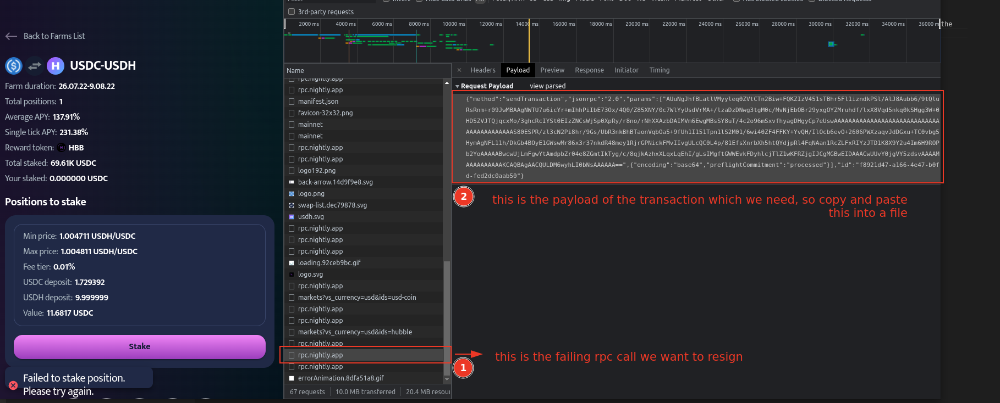

# resigner

# Warning

**Use at your own risk, I take  no responsibility for you losing money from this tool. Providing no support for this tool at all.**

# About

Solana transaction resigner, useful for resigning transactions to work around dapp rpc issues.

# Usage

1) **Acquire Transaction Payload**

Somehow get ahold of an `sendTransaction` payload. For example if you are using a dapp and their RPC is behind a number of slots leading to failed transactions, you can recover it from the network requests tab. The following image shows an overview of the data we are interested in getting




Save this to a file, name and extension doesn't mater. This example will use `info_file`. Make sure to copy the entire transaction payload.

2) **Resigning Transaction Payload**

First generate a configuration file, this will store the RPC endpoint we will be talking to, as well as how to access your private key. Ledger hardware wallets are supported, as well as the key files  generated by `solana-keygen`.

```sh
$> cargo build && cp target/debug/cli resigner
$> ./resigner config gen
$> vim config.yaml
... edit the file ...

#
# the following is an example of a configuration which uses a ledger wallet
# as well as a solana quiknode nedpoint
#---
#key_path: "usb://ledger?key=0"
#rpc_endpoints:
#  primary_endpoint:
#    http_url: "https://.quiknode.pro/.../"
#    ws_url: "ws://api.mainnet-beta.solana.com"


... finished editing the file ...
$> ./resigner resign --input-file input_file
# this will resign and resend the transaction
```